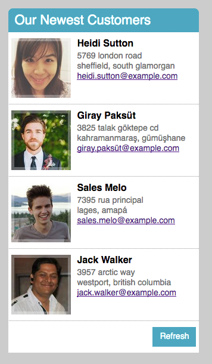

## Welcome to Haven Life's `Our Newest Customers` module!

This is a [Next.js](https://nextjs.org/) project bootstrapped with [`create-next-app`](https://github.com/vercel/next.js/tree/canary/packages/create-next-app).

### Getting Started

First, run the development server:

```bash
npm run dev
# or
yarn dev
# or
pnpm dev
```

Open [http://localhost:3000](http://localhost:3000) with your browser to see the result.

* Remember to `npm install` after cloning the repo.

## Project Specs

Below is a simple design for a module that we'd like you to recreate.

1. All of the data for the "Customers" here, both on initial load and whenever a user clicks the Refresh button, should be populated using the [Random User API](https://randomuser.me/). Their website has simple examples and usage instructions; it's just an Ajax call that returns a JSON object populated with dummy user info.
2. This is currently the mobile design, you can responsively adjust the layout to make it look nice on larger screens, but whatever "nice" means is up to you.
3. Don't spend time worrying about exact fonts, line-heights, etc. but the general look and feel should be in line with the above.
4. Please use a promise or promise-based library to interact with the API. An example of this is Axios, but you can also check out Q or Bluebird. Make sure that there are corresponding error states reflected on the front end as well.


